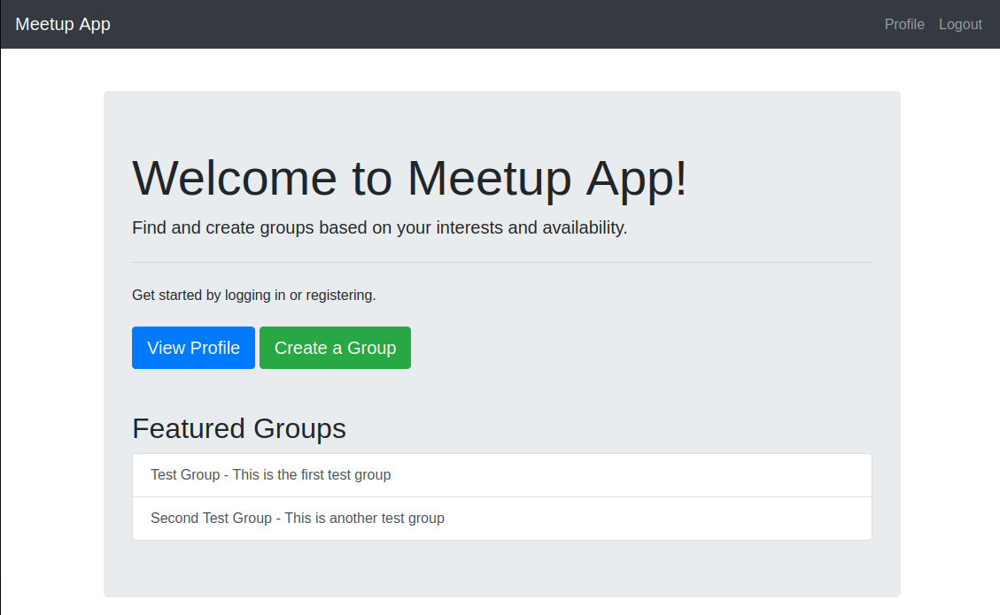
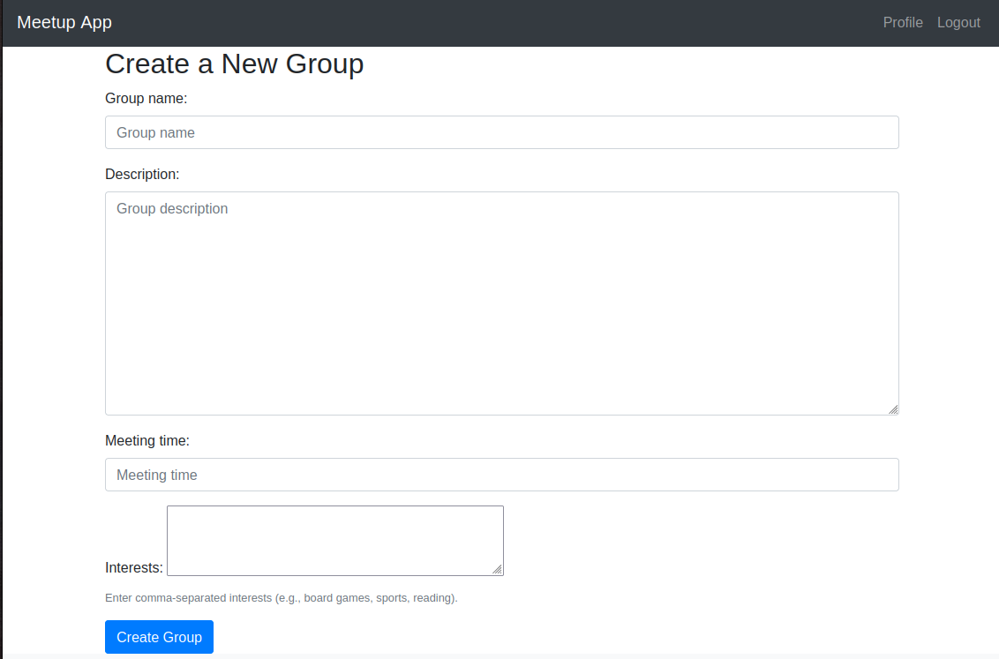

# **Meetup Application**

Welcome to the **Meetup Application**! This project is a web-based platform where users can create and join groups based on their interests and availability. It’s built using **Django**, a powerful Python web framework, and demonstrates my ability to design and implement a full-stack web application.

---

## **Features**

### **1. User Authentication**

- Users can **register**, **log in**, and **log out**.
- Secure password management using Django's built-in authentication system.

### **2. Group Creation and Management**

- Users can **create groups** based on their interests (e.g., board games, sports, reading).
- Each group has a **name**, **description**, and **meeting schedule**.

### **3. Availability Management**

- Users can specify their **general availability** (e.g., available on weekdays from 6 PM to 9 PM).
- Users can add **availability overrides** for specific dates (e.g., unavailable on a particular day).

### **4. Group Search**

- Users can **search for groups** based on their interests and meeting times.
- Search results are filtered to match the user's availability.

### **5. Responsive Design**

- The application is built with **Bootstrap** for a clean and responsive user interface.

---

## **Technologies Used**

- **Backend**: Django (Python)
- **Frontend**: HTML, CSS, Bootstrap
- **Database**: SQLite (default Django database)
- **Authentication**: Django's built-in authentication system
- **Deployment**: (Optional) Heroku, AWS, or any other platform

---

## **Key Skills Demonstrated**

This project showcases my ability to:

- Design and implement a **full-stack web application** using Django.
- Work with **Django models**, **forms**, and **views** to create a dynamic and interactive user experience.
- Use **Django's authentication system** to handle user registration, login, and logout securely.
- Implement **complex querying** to filter groups based on user availability and interests.
- Write **clean, modular, and maintainable code**.
- Use **Bootstrap** to create a responsive and visually appealing user interface.

---

## **How to Run the Project**

### **Prerequisites**

- Python 3.x
- Django 5.x

### **Setup Instructions**

1. Clone the repository:

   ```bash
   git clone https://github.com/Kev0264/meetup-app.git
   cd meetup-app
   ```

2. Create a virtual environment and install dependencies:

   ```bash
   python -m venv venv
   source venv/bin/activate  # On Windows: venv\Scripts\activate
   pip install -r requirements.txt
   ```

3. Apply migrations:

   ```bash
   python manage.py migrate
   ```

4. Create a superuser (optional):

   ```bash
   python manage.py createsuperuser
   ```

5. Run the development server:

   ```bash
   python manage.py runserver
   ```

6. Open your browser and navigate to `http://localhost:8000/`.

---

## **Project Structure**

```
meetup-app/
├── meetup_app/               # Django project settings
├── core/                     # Home page
├── users/                    # User authentication and profiles
├── groups/                   # Group creation and management
├── availability/             # Availability management
├── templates/                # Base and shared templates
│   └── base.html
├── static/                   # Static files (CSS, JS, images)
├── manage.py
└── README.md
```

---

## **Screenshots**

### **Home Page**



### **Group Creation**



### **Availability Management**

(Coming Soon)


---

## **Future Enhancements**

- Update availability so it isn't a free form text box
- Update interests to be its own model instead of a CSV
- Add **real-time notifications** for group updates.
- Implement **email notifications** for group invitations and reminders.
- Integrate with a **calendar API** (e.g., Google Calendar) to sync meeting times.
- Add **group chat functionality** using WebSockets.
- Deploy the application to a cloud platform (e.g., Heroku, AWS).

---

## **License**

This project is licensed under the MIT License. See the [LICENSE](LICENSE) file for details.

---
